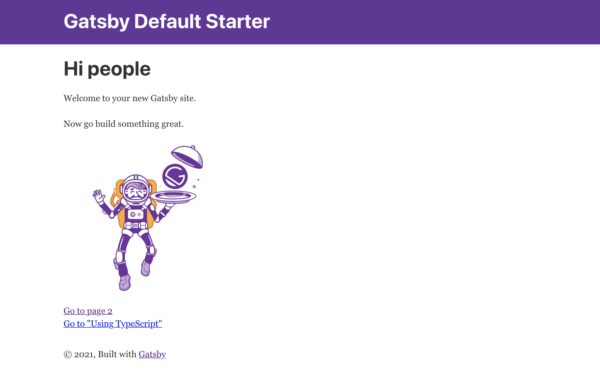

# Step1 導入 初期設定 ページリンクテスト

## How to use gatsby-cli <a id="how-to-use-gatsby-cli"></a>

[https://www.gatsbyjs.com/docs/reference/gatsby-cli/](https://www.gatsbyjs.com/docs/reference/gatsby-cli/)

```text
$ npm install -g gatsby-cli
$ gatsby new gatsby-dev
$ gatsby develop
```

もし`master`になっていたら`main`に変更 `git branch -m main`

### 表示 [http://localhost:8000/](http://localhost:8000/)



### ページ２の確認 [http://localhost:8000/page-2/](http://localhost:8000/page-2/)

## 構造の確認

参考 tree

`tree -a -I ".DS_Store|.git|node_modules|.cache|public|vendor\/bundle" -N -L 3`

[tree コマンドを Homebrew でインストール](https://dot-blog.jp/news/mac-zsh-tree/)

[tree コマンドの表示条件を指定する](https://qiita.com/ebkn/items/03e7679feeb3f0bb7ef8)

```yaml
.
├── .gitignore
├── .prettierignore
├── .prettierrc
├── LICENSE
├── README.md
├── gatsby-browser.js
├── gatsby-config.js
├── gatsby-node.js
├── gatsby-ssr.js
├── package-lock.json
├── package.json
└── src
├── components
│   ├── header.js
│   ├── layout.css
│   ├── layout.js
│   └── seo.js
├── images
│   ├── gatsby-astronaut.png
│   └── gatsby-icon.png
└── pages
├── 404.js
├── index.js
├── page-2.js
└── using-typescript.tsx
```


## ページ追加テスト

`pages/page-2.js` - &gt; copy & create `page-3.js`

実装結果[https://github.com/BoxPistols/gatsby-dev/pull/1/files](https://github.com/BoxPistols/gatsby-dev/pull/1/files)

